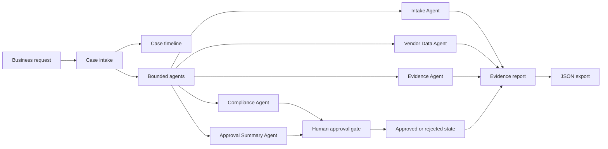

# Architecture

## System Goal

SwarmOps Case Commander gives enterprise operations teams a governed way to use AI agents inside exception-heavy case work. The system separates safe automated work from actions that require human approval, and every agent output becomes evidence in an audit report.

## Prototype Architecture



## Current Local Prototype

- `prototype/index.html` renders the command center.
- `prototype/app.js` owns the case state, approval transition, timeline status, and evidence export.
- `prototype/styles.css` provides the operational dashboard layout.
- `data/sample-case.json` provides the seeded vendor onboarding case.
- `prototype/smoke_check.py` verifies the structural requirements and seeded data.

## State Model

```text
case
  case_id
  title
  request
  vendor
  stages[]
  agents[]
  approval_queue[]
  final_status
```

Every agent output has:

```text
name
output
risk
evidence_id
```

Every approval item has:

```text
id
label
status
risk
reason
```

## UiPath Integration Target

The local prototype is intentionally small so the UiPath layer can become the orchestration layer rather than a cosmetic badge.

| SwarmOps concept | UiPath target |
| --- | --- |
| Case stages | UiPath Maestro Case stages |
| Approval queue | Human task / approval step |
| Safe agent output | Robot or API step |
| Evidence JSON | Case artifact / audit attachment |
| Final status | Case completion state |

## Trust Boundary

- Agents produce proposed outputs and evidence.
- High-risk business actions stay blocked until a human approves them.
- The evidence report records the state transition and risk reason.
- The prototype does not claim to complete payment setup, vendor acceptance, external email, or procurement-system writes without approval.

## Production Path

1. Replace seeded JSON with a small local API.
2. Add persistent case storage.
3. Connect UiPath Maestro Case to call the SwarmOps evidence endpoint.
4. Attach generated evidence JSON to the case.
5. Record approval state transitions in UiPath.
6. Package public repo, deck, and under-five-minute demo video.
